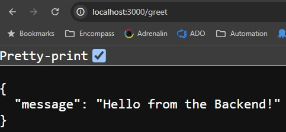

# Accuknox : Application Health Checker Script

This repo includes a Python script to check if the Frontend Service used in Problem Statement 1 running on localhost:8080 is up or down, and a PowerShell script to check the uptime of the Frontend Kubernetes service.

## Prerequisites

- [Minikube](https://minikube.sigs.k8s.io/docs/start/)
- [kubectl](https://kubernetes.io/docs/tasks/tools/)
- [Python](https://www.python.org/)
- [Powershell](https://learn.microsoft.com/en-us/powershell/)

## Steps to Start Minikube and Deploy Services

1. **Start Minikube:**
    ```bash
    > minikube start
    ```

2. **Deploy Front End and Back End Services:**
    ```bash
    > kubectl apply -f frontend-deployment.yaml, backend-deployment.yaml
    ```
    **Output**
    ```bash
    deployment.apps/frontend-deployment created
    service/frontend-service created
    deployment.apps/backend-deployment created
    service/backend-service created
    ```

3. **Get Pod Names:**
    ```bash
    > kubectl get pods
    ```
    **Output**
    ```bash
    NAME                                   READY   STATUS    RESTARTS   AGE
    backend-deployment-6bc7544b64-6m6sl    1/1     Running   0          6m47s
    backend-deployment-6bc7544b64-wgh7t    1/1     Running   0          6m47s
    frontend-deployment-6485c5c85c-bmzcg   1/1     Running   0          6m47s
    ```

4. **Port Forward Front End Service:**
    ```bash
    > kubectl port-forward service/frontend-service 8080:80
    ```
    **Output**
    ```bash
    Forwarding from 127.0.0.1:8080 -> 8080
    Forwarding from [::1]:8080 -> 8080
    ```

5. **Port Forward Back End Service:**
    ```bash
    > kubectl port-forward service/backend-service 3000:3000
    ```
    **Output**
    ```bash
    Forwarding from 127.0.0.1:3000 -> 3000
    Forwarding from [::1]:3000 -> 3000
    ```

6. **Access Front End URL:**
    ```
    http://localhost:8080
    ```
    **Output**

    
    

7. **Access Back End URL:**
    ```
    http://localhost:3000/greet
    ```
    **Output**

    
    ```

## Creating a Powershell Script and running the script
1. **Create a powershell script named `uptime_check.ps1` to to check the uptime of the kubernetes frontend service**
    <details>
        <summary>Code : uptime_check.ps1</summary>

    ```powershell
        $startDatetime=$(kubectl get services frontend-service -o=jsonpath='{.metadata.creationTimestamp}')
        echo $startDatetime
        $startTime=[DateTime]$startDatetime
        $endTime=[DateTime]::Now
        echo $startTime
        echo $endTime
        $duration=$endTime-$startTime
        echo "Diff in seconds: $duration.Seconds"
    ```
    </details>

2. **Run the powershell script**
    ```bash
    > powershell -File uptime_check.ps1
    ```
    **Output**
    ```bash
    2024-07-08T04:33:17Z

    08 July 2024 10:03:17
    08 July 2024 13:24:54
    Diff in seconds: 03:21:37.2782455.Seconds
    ```

## Python Installation
1. Install Python 3.x from the [official website](https://www.python.org/).
2. Install the `psutil` library using pip:

    ```bash
    > pip install psutil
    ```

## Creating a python file and running the script

1. **Create a python file named `app_uptime_check.py` to check the uptime of the frontend service url**

    <details>
    <summary>Code : system_health_monitor.py</summary>
  
    ```py
    import requests
    def get_service_status(service_url):
    try:
        result = requests.get(service_url)
        if result.status_code == 200:
              return 'up'
        else:
              return 'down'
    except requests.RequestException as error:
        print(f"An error occurred: {error}")
        return 'down'

    if __name__ == "__main__":
        service_url = "http://localhost:8080"
        service_status = get_service_status(service_url)
        print(f"The service is {service_status}.")
    ```
    </details>

2. **Run the script**
   ```bash
   > python .\app_uptime_check.py
   ```
   **Output**
   

