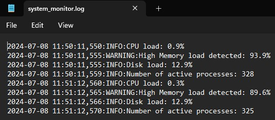

# Accuknox : System Health Monitoring Script

This repo provides a Python script to monitor system health, like CPU, memory, and disk usage and the number of running processes. The script uses the `psutil` library to gather system metrics and logs the information using Python's built-in `logging` module.

## Features

- Monitors CPU usage and logs warnings if it exceeds a defined threshold.
- Monitors memory usage and logs warnings if it exceeds a defined threshold.
- Monitors disk usage and logs warnings if it exceeds a defined threshold.
- Logs the number of running processes.

## Prerequisites

- Python 3.x
- `psutil` library

## Installation

1. Install Python 3.x from the [official website](https://www.python.org/).
2. Install the `psutil` library using pip:

```bash
pip install psutil
```

## Creating and Running the Script

1. **Create a python File Named `system_health_monitor.py` to monitor system health, like CPU, memory, and disk usage and the number of running processes :**

    <details>
    <summary>Code : system_health_monitor.py</summary>
  
    ```py
    import psutil
    import time
    import logging

    # Configure logging
    logging.basicConfig(filename='system_monitor.log', level=logging.INFO,
                        format='%(asctime)s:%(levelname)s:%(message)s')

    # Define thresholds
    CPU_USAGE_THRESHOLD = 80  # in percentage
    MEMORY_USAGE_THRESHOLD = 80  # in percentage
    DISK_USAGE_THRESHOLD = 80  # in percentage

    def monitor_cpu():
        cpu_load = psutil.cpu_percent(interval=1)
        if cpu_load > CPU_USAGE_THRESHOLD:
            logging.warning(f"High CPU load detected: {cpu_load}%")
        else:
            logging.info(f"CPU load: {cpu_load}%")
        return cpu_load

    def monitor_memory():
        memory_info = psutil.virtual_memory()
        memory_load = memory_info.percent
        if memory_load > MEMORY_USAGE_THRESHOLD:
            logging.warning(f"High Memory load detected: {memory_load}%")
        else:
            logging.info(f"Memory load: {memory_load}%")
        return memory_load

    def monitor_disk():
        disk_load = psutil.disk_usage('/').percent
        if disk_load > DISK_USAGE_THRESHOLD:
            logging.warning(f"High Disk load detected: {disk_load}%")
        else:
            logging.info(f"Disk load: {disk_load}%")
        return disk_load

    def monitor_processes():
        total_processes = len(psutil.pids())
        logging.info(f"Number of active processes: {total_processes}")
        return total_processes

    def start_monitoring():
        while True:
            monitor_cpu()
            monitor_memory()
            monitor_disk()
            monitor_processes()
            time.sleep(60)  # Check every 60 seconds

    if __name__ == "__main__":
    start_monitoring()

    ```
    </details>

2. **Running the Script:**
    ```bash
    > python system_monitor.py
    ```
    **Log File Output**
    