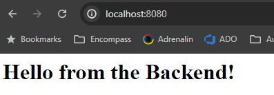
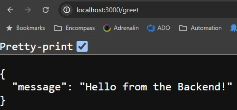
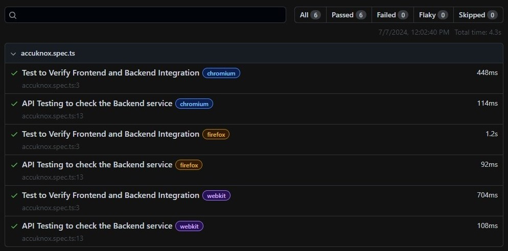
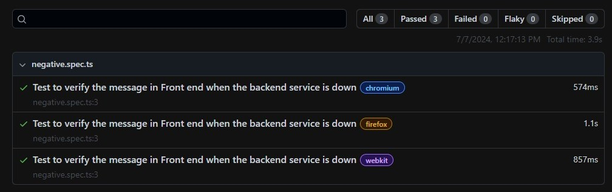

# Accuknox Integration and API Testing

This repository contains instructions to start the Minikube, deploy frontend and backend services, and perform automation testing using Playwright to validate the Frontend and Backend Integration.

## Prerequisites

- [Minikube](https://minikube.sigs.k8s.io/docs/start/)
- [kubectl](https://kubernetes.io/docs/tasks/tools/)
- [Node.js](https://nodejs.org/)
- [Playwright](https://playwright.dev/)

## Steps to Start Minikube and Deploy Services

1. **Start Minikube:**
    ```bash
    > minikube start
    ```

2. **Deploy Front End and Back End Services:**
    ```bash
    > kubectl apply -f frontend-deployment.yaml, backend-deployment.yaml
    ```
    **Output**
    ```bash
    deployment.apps/frontend-deployment created
    service/frontend-service created
    deployment.apps/backend-deployment created
    service/backend-service created
    ```

3. **Get Pod Names:**
    ```bash
    > kubectl get pods
    ```
    **Output**
    ```bash
    NAME                                   READY   STATUS    RESTARTS   AGE
    backend-deployment-6bc7544b64-6m6sl    1/1     Running   0          6m47s
    backend-deployment-6bc7544b64-wgh7t    1/1     Running   0          6m47s
    frontend-deployment-6485c5c85c-bmzcg   1/1     Running   0          6m47s
    ```

4. **Port Forward Front End Service:**
    ```bash
    > kubectl port-forward service/frontend-service 8080:80
    ```
    **Output**
    ```bash
    Forwarding from 127.0.0.1:8080 -> 8080
    Forwarding from [::1]:8080 -> 8080
    ```

5. **Port Forward Back End Service:**
    ```bash
    > kubectl port-forward service/backend-service 3000:3000
    ```
    **Output**
    ```bash
    Forwarding from 127.0.0.1:3000 -> 3000
    Forwarding from [::1]:3000 -> 3000
    ```

6. **Access Front End URL:**
    ```
    http://localhost:8080
    ```
    **Output**

    
    

7. **Access Back End URL:**
    ```
    http://localhost:3000/greet
    ```
    **Output**

    

## Automation & API Testing with Playwright

1. **Install Playwright:**
    ```bash
    > npm init playwright@latest
    ```

2. **Create a Test File Named `accuknox.spec.ts` to perform frontend and backend integration and API testing :**

    <details>
    <summary>Code : accuknox.spec.ts</summary>
  
    ```typescript
    import { test, expect } from '@playwright/test';
    
    test('Test to Verify Frontend and Backend Integration', async ({ page }) => {
    //Navigating to the Frontend URL
    await page.goto('http://localhost:8080');

    //validating the message using getByRole attribute
    await expect(page.getByRole('heading', { name: 'Hello from the Backend!' })).toBeVisible();

    //validating the message using innerText attribute
    expect(await page.innerText('h1')).toBe('Hello from the Backend!');
    });

    test('API Testing to check the Backend service', async ({ request }) => {
    const response = await request.get("http://localhost:3000/greet");
    
    //print the response in console
    console.log(await response.json());
    
    //Check if the response to be true
    expect(response.ok()).toBeTruthy();
    
    //Check if the HTTP Status code is 200
    expect(response.status()).toBe(200);
    
    //Validate the response body to be "Hello from the Backend!"
    const respBody = await response.json();
    expect(respBody.message).toBe('Hello from the Backend!');
    })
    ```
    </details>

3. **Create a Test file named `negative.spec.ts` to verify the frontend message when the backend service is down**

    <details>
    <summary>Code : negative.spec.ts</summary>
    
    ```typescript
    import { test, expect } from '@playwright/test';
    
    test('Test to verify the message in Front end when the backend service is down', async ({ page }) => {
    //Navigating to the Frontend URL
    await page.goto('http://localhost:8080');
    
    //Printing the message displayed in the Frontend
    console.log(await page.innerText('h1'));

    //validating the message using getByRole attribute
    await expect(page.getByRole('heading', { name: 'Hello, World!' })).toBeTruthy();

    //validating the message using innerText attribute
    expect(await page.innerText('h1')).toBe('Hello, World!');
    });
    ```
    </details>

4. **Run the Tests:**

    **Positive Testcase**
    ```bash
    > npx playwright test accuknox.spec.ts
    ```
    **Output**
    ```bash
    Running 6 tests using 6 workers
    [chromium] › accuknox.spec.ts:13:5 › API Testing to check the Backend service
    { message: 'Hello from the Backend!' }
    [firefox] › accuknox.spec.ts:13:5 › API Testing to check the Backend service
    { message: 'Hello from the Backend!' }
    [webkit] › accuknox.spec.ts:13:5 › API Testing to check the Backend service
    { message: 'Hello from the Backend!' }
    6 passed (4.3s)
    ```
    **Report**
    ```bash
    > npx playwright show-report
    ```
    

    **Negative Testcase**
    ```bash
    > npx playwright test negative.spec.ts
    ```
    **Output**
    ```bash
    Running 3 tests using 3 workers
    [webkit] › negative.spec.ts:3:5 › Test to verify the message in Front end when the backend service is down
    Hello, World!
    [chromium] › negative.spec.ts:3:5 › Test to verify the message in Front end when the backend service is down
    Hello, World!
    [firefox] › negative.spec.ts:3:5 › Test to verify the message in Front end when the backend service is down
    Hello, World!
    3 passed (3.9s)
    ```
    **Report**
    ```bash
    > npx playwright show-report
    ```
    
