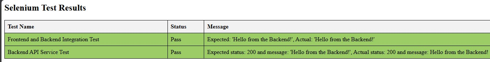
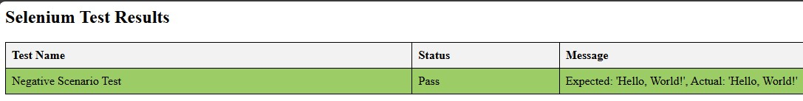

# Accuknox Integration and API Testing

This repository contains instructions to start the Minikube, deploy frontend and backend services, and perform automation testing using Selenium to validate the Frontend and Backend Integration.

## Prerequisites

- [Minikube](https://minikube.sigs.k8s.io/docs/start/)
- [kubectl](https://kubernetes.io/docs/tasks/tools/)
- [Node.js](https://nodejs.org/)
- [Selenium](https://selenium.dev/)

## Steps to Start Minikube and Deploy Services

1. **Start Minikube:**
    ```bash
    > minikube start
    ```

2. **Deploy Front End and Back End Services:**
    ```bash
    > kubectl apply -f frontend-deployment.yaml, backend-deployment.yaml
    ```
    **Output**
    ```bash
    deployment.apps/frontend-deployment created
    service/frontend-service created
    deployment.apps/backend-deployment created
    service/backend-service created
    ```

3. **Get Pod Names:**
    ```bash
    > kubectl get pods
    ```
    **Output**
    ```bash
    NAME                                   READY   STATUS    RESTARTS   AGE
    backend-deployment-6bc7544b64-6m6sl    1/1     Running   0          6m47s
    backend-deployment-6bc7544b64-wgh7t    1/1     Running   0          6m47s
    frontend-deployment-6485c5c85c-bmzcg   1/1     Running   0          6m47s
    ```

4. **Port Forward Front End Service:**
    ```bash
    > kubectl port-forward service/frontend-service 8080:80
    ```
    **Output**
    ```bash
    Forwarding from 127.0.0.1:8080 -> 8080
    Forwarding from [::1]:8080 -> 8080
    ```

5. **Port Forward Back End Service:**
    ```bash
    > kubectl port-forward service/backend-service 3000:3000
    ```
    **Output**
    ```bash
    Forwarding from 127.0.0.1:3000 -> 3000
    Forwarding from [::1]:3000 -> 3000
    ```

6. **Access Front End URL:**
    ```
    http://localhost:8080
    ```
    **Output**

    
    

7. **Access Back End URL:**
    ```
    http://localhost:3000/greet
    ```
    **Output**

    

## Automation & API Testing with Selenium

1. **Install Selenium Webdriver :**
    ```bash
    > npm install selenium-webdriver
    ```

2. **Create a Test File Named `integration_test.js` to perform frontend and backend integration and API testing :**

    <details>
    <summary>Code : integration_test.js</summary>
  
    ```js
    const { Builder, By, until } = require('selenium-webdriver');
    const assert = require('assert');
    const fetch = require('cross-fetch');
    const fs = require('fs-extra');

    let testResults = [];

    async function testFrontendAndBackendIntegration() {
    let driver = await new Builder().forBrowser('chrome').build();

    try {
            let result = {};

            // Navigate to the frontend URL
            await driver.get('http://localhost:8080');

            // Validate the message using getByRole attribute
            await driver.wait(until.elementLocated(By.xpath('//h1[contains(text(), "Hello from the Backend!")]')), 10000);
            let headingElement = await driver.findElement(By.xpath('//h1[contains(text(), "Hello from the Backend!")]'));
            await driver.wait(until.elementIsVisible(headingElement), 10000);

            // Validate the message using innerText attribute
            let h1Text = await headingElement.getText();
            result.testName = 'Frontend and Backend Integration Test';
            result.status = (h1Text === 'Hello from the Backend!') ? 'Pass' : 'Fail';
            result.message = `Expected: 'Hello from the Backend!', Actual: '${h1Text}'`;

            testResults.push(result);
        } catch (error) {
            console.error('Error in Frontend and Backend Integration Test:', error);
            result.testName = 'Frontend and Backend Integration Test';
            result.status = 'Error';
            result.message = error.toString();
            testResults.push(result);
        } finally 
        {
            await driver.quit();
        }
    }

    async function testBackendAPIService() {
        let driver = await new Builder().forBrowser('chrome').build();

    try {
            let result = {};

            // Perform API testing to check the backend service
            const response = await fetch('http://localhost:3000/greet');
            const responseBody = await response.json();

            // Validate response status and message
            result.testName = 'Backend API Service Test';
            result.status = (response.status === 200 && responseBody.message === 'Hello from the Backend!') ? 'Pass' : 'Fail';
            result.message = `Expected status: 200 and message: 'Hello from the Backend!', Actual status: ${response.status} and message: ${responseBody.message}`;

            testResults.push(result);
    } catch (error) {
            console.error('Error in Backend API Service Test:', error);
            result.testName = 'Backend API Service Test';
            result.status = 'Error';
            result.message = error.toString();
            testResults.push(result);
    } finally {
        await driver.quit();
    }
    }

    // Running the tests
    async function runTests() {
    await testFrontendAndBackendIntegration();
    await testBackendAPIService();

    // Generate HTML report
    generateHTMLReport();
    }

    // Function to generate HTML report
    function generateHTMLReport() {
    let htmlContent = `
    <html>
        <head>
        <style>
            table {
            border-collapse: collapse;
            width: 100%;
            }
            th, td {
            border: 1px solid black;
            padding: 8px;
            text-align: left;
            }
            th {
            background-color: #f2f2f2;
            }
            .pass {
            background-color: #9CCC65;
            }
            .fail {
            background-color: #EF9A9A;
            }
            .error {
            background-color: #FFEB3B;
            }
        </style>
        </head>
        <body>
        <h2>Selenium Test Results</h2>
        <table>
            <tr>
            <th>Test Name</th>
            <th>Status</th>
            <th>Message</th>
            </tr>
    `;

    testResults.forEach(result => {
        let statusClass = '';
        if (result.status === 'Pass') {
        statusClass = 'pass';
        } else if (result.status === 'Fail') {
        statusClass = 'fail';
        } else {
        statusClass = 'error';
        }

        htmlContent += `
        <tr class="${statusClass}">
            <td>${result.testName}</td>
            <td>${result.status}</td>
            <td>${result.message}</td>
        </tr>
        `;
    });

    htmlContent += `
        </table>
        </body>
    </html>
    `;

    fs.writeFileSync('selenium_test_results.html', htmlContent);
    console.log('HTML report generated: selenium_test_results.html');
    }

    // Execute tests and generate report
    runTests().catch(err => console.error('Test execution error:', err));
    ```
    </details>

3. **Create a Test file named `negativeScenario.js` to verify the frontend message when the backend service is down**

    <details>
    <summary>negativeScenario.js</summary>
    
    ```js
    const { Builder, By, until } = require('selenium-webdriver');
    const assert = require('assert');
    const fetch = require('cross-fetch');
    const fs = require('fs-extra');

    let testResults = [];

    async function testNegativeScenario() {
    let driver = await new Builder().forBrowser('chrome').build();

    try {
            let result = {};

            // Navigate to the frontend URL
            await driver.get('http://localhost:8080');

            // Validate the message using getByRole attribute
            await driver.wait(until.elementLocated(By.xpath('//h1[contains(text(), "Hello, World!")]')), 10000);
            let headingElement = await driver.findElement(By.xpath('//h1[contains(text(), "Hello, World!")]'));
            await driver.wait(until.elementIsVisible(headingElement), 10000);

            // Validate the message using innerText attribute
            let h1Text = await headingElement.getText();
            result.testName = 'Negative Scenario Test';
            result.status = (h1Text === 'Hello, World!') ? 'Pass' : 'Fail';
            result.message = `Expected: 'Hello, World!', Actual: '${h1Text}'`;

            testResults.push(result);
        } catch (error) {
            console.error('Error in Negative Scenario Test:', error);
            result.testName = 'Negative Scenario Test';
            result.status = 'Error';
            result.message = error.toString();
            testResults.push(result);
        } finally {
            await driver.quit();
        }
    }

    // Running the tests
    async function runTests() {
        await testNegativeScenario();

        // Generate HTML report
        generateHTMLReport();
    }

    // Function to generate HTML report
    function generateHTMLReport() {
        let htmlContent = `
        <html>
            <head>
            <style>
                table {
                border-collapse: collapse;
                width: 100%;
                }
                th, td {
                border: 1px solid black;
                padding: 8px;
                text-align: left;
                }
                th {
                background-color: #f2f2f2;
                }
                .pass {
                background-color: #9CCC65;
                }
                .fail {
                background-color: #EF9A9A;
                }
                .error {
                background-color: #FFEB3B;
                }
            </style>
            </head>
            <body>
            <h2>Selenium Test Results</h2>
            <table>
                <tr>
                <th>Test Name</th>
                <th>Status</th>
                <th>Message</th>
                </tr>
        `;

        testResults.forEach(result => {
            let statusClass = '';
            if (result.status === 'Pass') {
            statusClass = 'pass';
            } else if (result.status === 'Fail') {
            statusClass = 'fail';
            } else {
            statusClass = 'error';
            }   

            htmlContent += `
            <tr class="${statusClass}">
                <td>${result.testName}</td>
                <td>${result.status}</td>
                <td>${result.message}</td>
            </tr>
            `;
        });

        htmlContent += `
            </table>
            </body>
        </html>
        `;

        fs.writeFileSync('selenium_test_results.html', htmlContent);
        console.log('HTML report generated: selenium_test_results.html');
    }

    // Execute tests and generate report
    runTests().catch(err => console.error('Test execution error:', err));
    ```
    </details>

4. **Run the Tests:**

    **Positive Testcase**
    ```bash
    > node integration_test.js
    ```
    **Output**
    ```bash
    DevTools listening on ws://127.0.0.1:52566/devtools/browser/1a4e1208-5dac-45e4-8985-b22375850326

    DevTools listening on ws://127.0.0.1:52581/devtools/browser/cebd71a9-3c2e-4bd6-99b3-2ec4f9e538c9
    HTML report generated: selenium_test_results.html
    ```
    **Report**

    

    **Negative Testcase**
    ```bash
    > node negativeScenario.js
    ```
    **Output**
    ```bash
    DevTools listening on ws://127.0.0.1:52767/devtools/browser/0be65b74-3d24-4020-a996-0d1c33aafb86
    HTML report generated: selenium_test_results.html
    ```
    **Report**

    
